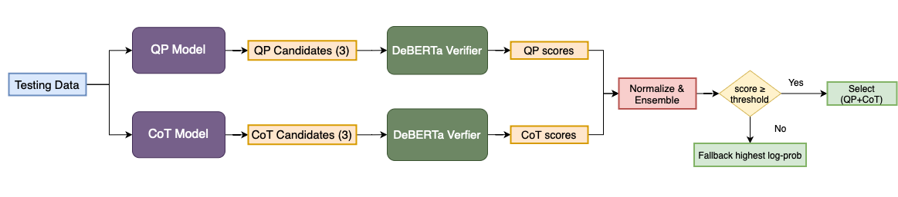

# LLM-SR: Structured Reasoning with Large Language Models

[](https://colab.research.google.com/drive/1Pqafok5gu788MNIYvlRlzYZw_I1-kTit)
[](https://xllms.github.io/LLMSR/)


LLM-SR (LLM for Structural Reasoning) is a modular pipeline for transforming free-form logical puzzles and their unstructured chains of thought into rich annotated, machine-readable representations. Given a puzzle (question) and its LLM-generated CoT (cot), LLM-SR produces:

**Question Parsing**: a list of all extracted constraints and conditions from the problem statement.

**CoT Parsing**: a sequence of reasoning steps, each paired with its supporting evidence and a Boolean “Verification” flag.

Below is a concrete example of one data record in our pipeline:

```json5
{
"question": "In a class of 30 students, 18 play basketball, 15 play soccer, and 10 students play both sports. What is the probability that a student picked at random from this class plays neither basketball nor soccer?\nA. The probability that a student picked at random does not play either sport is 7 out of 30.\nB. The probability that a student picked at random does not play either sport is 7 out of 30 (estimate)\nC. The probability that a student picked at random does not play either sport is 7 out of 30\nD. The probability that a student picked at random does not play either sport is 7 out of 30?",
"question_parsing": [
"In a class of 30 students",
"18 play basketball",
"15 play soccer",
"10 students play both sports",
"What is the probability that a student picked at random from this class plays neither basketball nor soccer?"
],
"answer": "a",
"id": 99946,
"cot": "First, we find the number of students who play either basketball or soccer by using the inclusion-exclusion principle. There are 18 students who play basketball and 15 who play soccer, but since 10 students play both, we count them once. So, the total number of students who play at least one sport is 18 + 15 - 10 = 23. To find the number of students who play neither sport, we subtract the number of students who play basketball or soccer from the total number of students. Hence, 30 - 23 = 7 students play neither. Therefore, the probability is the number of students who play neither divided by the total number of students: 7/30.",
"cot_parsing": [
{
"statement": "Total students playing at least one sport is 23",
"evidence": "18 play basketball + 15 play soccer − 10 play both = 23",
"Verification": "true"
},
{
"statement": "7 students do not play either sport",
"evidence": "30 total − 23 playing = 7",
"Verification": "true"
},
{
"statement": "The probability of picking a student who plays neither sport is 7/30",
"evidence": "7 students playing neither / 30 total = 7/30",
"Verification": "true"
}
],
"sel_idx": 580
}
```

This example demonstrates how a single puzzle is converted into the question_parsing and cot_parsing structures that our models are trained to reproduce.

--- 
## Table of Contents

1. [Project Description](#project-description)
2. [Project Structure](#project-structure)
3. [Setup Instructions](#setup-instructions)
4. [Running the Project](#running-the-project)
5. [Fine-Tuned Models on Hugging Face](#fine-tuned-models-on-hugging-face)
6. [Approaches & Strategies](#approaches--strategies)
7. [Reproducibility](#reproducibility)
8. [Team Contributions](#team-contributions)
9. [Results - Comparative Summary](#results---comparative-summary)
10. [References](#references)

---

## Project Description

This project was developed for the [ACL 2025 Shared Task: LLM for Structural Reasoning (LLM-SR)](https://xllms.github.io/LLMSR/), which aims to extract interpretable, structured reasoning steps from natural language questions and chain-of-thoughts (CoT). The task focuses on producing two structured outputs:

- **`question_parsing`**: a list of logical constraints extracted from the question text.  
- **`cot_parsing`**: a step-by-step breakdown of the CoT, where each step includes a `statement`, `evidence`, and a boolean `Verification` flag.

### Step 0: LLM-SR System
   

  **Input:**  
  - A natural language **question**  
  - A **chain-of-thought (CoT)** explanation  

  **Output:**  
  - **`question_parsing`**: list of extracted logical constraints  
  - **`cot_parsing`**: structured reasoning steps with:
   - `statement`: the claim
   - `evidence`: supporting justification
   - `Verification`: `"true"` or `"false"`

--- 

Our pipeline follows a modular approach that includes:

### Step 1: Synthetic Data Generation
   We use logical puzzles from a Hugging Face dataset to create 700 high-quality synthetic examples in the target structure (`question`, `cot`, `question_parsing`, `cot_parsing`).

   

  **Input:**  
  - Raw logic Puzzles 
 
  **Output:**  
  - Our Reasoning Dataset

---
### Step 2: Dataset Construction

We split the examples into two training datasets:
- `train_question_parsing.jsonl` for question parsing  
- `train_cot_parsing.jsonl` for CoT parsing  


**Input:**  
- Our Reasoning Dataset

**Output:**  
- `train_question_parsing.jsonl`  
- `train_cot_parsing.jsonl`

-----
### Step 3: Model Fine-Tuning

Two LLaMA-3-8B-Instruct models are fine-tuned using LoRA adapters:
- QP Model for `question_parsing`
- CoT for `cot_parsing`


**Input:**  
- `train_question_parsing.jsonl` for question parsing
- `train_cot_parsing.jsonl` for CoT parsing

**Output:**  
- QP model weights and tokenizer
- CoT model weights and tokenizer
---
### Step 4: Inference 
The fine-tuned models are used to parse new test questions. Our testing data includes only the question (the logical puzzle) and the chain-of-thought for the question. 


**Input:**  
- `testingData-blank.jsonl` for question and CoT parsing

**Output:**  
- Predictions including the `question_parsing`and `cot_parsing`

----
### Step 5: Evaluation
Our final predictions are evaluated with macro F1 scores using the official `eval.py` script provided by the challenge organizers.


**Input:**  
- Final Predictions question and CoT parsing

**Output:**  
- `Question Macro F1`
- `Statement Macro F1`
- `Statement Evidence Macro F1`
- `Reasoning F1`


This approach enables controllable and explainable reasoning, supporting future developments in process-level reward modeling.

---


## Project Structure

```
.
├── data/
│   ├── raw/                          # Raw logical puzzles (e.g., LogiQA)
│   └── processed/                    # Preprocessed train/test datasets
├── diagrams/                         # draw.io source files (editable)
├── images/                           # Exported diagram visuals for documentation
├── metrics/                          # Evaluation results (JSON + markdown)
│   ├── *.json                        # Per-strategy evaluation metrics
│   └── evaluation_table.md           # Summary comparison table
├── predictions/                      # Final test predictions from inference
├── utils/                            # Helper scripts (e.g., evaluation)
│   └── eval.py
├── .gitignore
├── requirements.txt                  # Project dependencies
├── README.md                         # Project overview and instructions
├── 0_Data_Generation_and_Transformation.ipynb  # Preprocessing 700 dataset
├── 1_Preprocessing.ipynb             # Preprocessing pipeline
├── 2_Baseline.ipynb                  # Weak baselines for comparison
├── 3_Training.ipynb                  # Fine-tuning LoRA adapters
├── 4_Evaluation.ipynb                # Metric reporting + analysis
├── 5_Demo.ipynb                      # End-to-end test demo
├── 6_DeepSeek_Benchmark.ipynb        # DeepSeek-Coder baseline
├── 7_Reward-Based Reranking.ipynb    # Reranking with reward model
├── 8_Joint Verifier+Ensemble Scoring.ipynb  # QP + CoT DeBERTa Verifiers
├── 9_Training Two Seperate Verifiers.ipynb  # Train separate verifiers
├── Hybrid_Inference_Strategy_v1.ipynb       # Simple hybrid strategy
├── Hybrid_Inference_Strategy_v2.ipynb       # Beam + sampling + verifier reranking
├── Hybrid_Inference_Strategy_v3.ipynb       # CoT cleaning improvements
├── Hybrid_Inference_Strategy_v4.ipynb       # Structure-aware scoring with weights
├── Hybrid_Inference_Strategy_Ablation.ipynb  # Ablation Study using QP+CoT Verifiers
```

---
## Setup Instructions

### Clone Repository
```bash
git clone https://github.com/CoKn/LLM-for-Structural-Reasoning.git
cd LLM-for-Structural-Reasoning
```

### Create Environment
```bash
python -m venv venv
source venv/bin/activate     # For Mac/Linux
venv\Scripts\activate        # For Windows
```

### Install Dependencies
```bash
pip install -r requirements.txt
```

---

## Running the Project

Follow these notebooks in order to replicate the workflow:

1. `0_Data_Generation_and_Transformation.ipynb` – Preprocess the original 700 puzzles  
2. `1_Preprocessing.ipynb` – Convert datasets into JSONL format for training  
3. `2_Baseline.ipynb` – Run weak heuristic or rule-based baselines  
4. `3_Training.ipynb` – Fine-tune LoRA adapters for Question Parsing and CoT Parsing  
5. `4_Evaluation.ipynb` – Evaluate using structured metrics (F1 scores)   
6. `5_Demo.ipynb` – End-to-end prediction + evaluation on the test set   

Optional Notebooks:
- `6_DeepSeek_Benchmark.ipynb` – Run benchmark using DeepSeek-Coder   
- `7_Reward-Based Reranking.ipynb` – Rank CoTs using a reward model  
- `8_Joint Verifier+Ensemble Scoring.ipynb` – Use DeBERTa verifiers for scoring   
- `9_Training Two Seperate Verifiers.ipynb` – Fine-tune DeBERTa verifiers independently  
- `Hybrid_Inference_Strategy_v[1-4].ipynb` – Variants of multi-step hybrid inference pipelines
  
To evaluate predictions:
```bash
python utils/eval.py --predictions predictions/final.json --references data/processed/test.json
```

---
## Fine-Tuned Models on Hugging Face

We fine-tuned all models used in this project from publicly available LLMs (e.g., LLaMA-3, DeBERTa, DeepSeek) using **LoRA adapters** and our synthetic dataset. The trained adapters are hosted on the Hugging Face Hub under the author profile [Erlisa](https://huggingface.co/Erlisa), and can be used for inference or further fine-tuning.

- [finetuned_llama3_question_parsing](https://huggingface.co/Erlisa/models/tree/main/finetuned_llama3_question_parsing)
- [finetuned_llama3_cot_parsing](https://huggingface.co/Erlisa/models/tree/main/finetuned_llama3_cot_parsing)
- [deberta-qparse-verifier](https://huggingface.co/Erlisa/models/tree/main/deberta-qparse-verifier)
- [deberta-cotparse-verifier](https://huggingface.co/Erlisa/models/tree/main/deberta-cotparse-verifier)
- [deberta3-verifier-final](https://huggingface.co/Erlisa/models/tree/main/deberta3-verifier-final)
- [deepseek_adapter_qp_only](https://huggingface.co/Erlisa/models/tree/main/deepseek_adapter_qp_only)
- [deepseek_adapter_cot_only](https://huggingface.co/Erlisa/models/tree/main/deepseek_adapter_cot_only)

### How to Load a LoRA Model

```python
from transformers import AutoTokenizer, AutoModelForCausalLM
from peft import PeftModel

# Load base model (e.g., LLaMA-3)
base_model = AutoModelForCausalLM.from_pretrained("unsloth/llama-3-8b-Instruct")
tokenizer = AutoTokenizer.from_pretrained("Erlisa/finetuned_llama3_question_parsing")

# Load adapter
model = PeftModel.from_pretrained(base_model, "Erlisa/finetuned_llama3_question_parsing")
```
For DeBERTa-based verifier models, use AutoModelForSequenceClassification instead of AutoModelForCausalLM.

---
## Approaches & Strategies

Throughout the project, we experimented with multiple inference pipelines to improve structured reasoning quality. Below is a brief summary of the main strategies:

### 1. Initial LLaMA-3 Parsing

- **QP Stage:** Single LLaMA-3 model extracts constraints via in-context prompting.
- **CoT Stage:** LLaMA-3 parses chain-of-thought into structured reasoning steps.
- **Drawback:** No reranking or verification; lower precision on complex examples.

---

### 2. Reward Model Reranking


- **Generated 5 candidates** (2 beam + 3 sampled).
- Scored each candidate’s steps using `OpenAssistant/reward-model-deberta-v3-large-v2`.
- Added bonuses for logical terms, references, and coherence.
- Selected the **highest-scoring** candidate for output.


---

### 3. Joint Verifier + Ensemble Reranking



- **QP:** Sampled 3 QP candidates, verified via fine-tuned DeBERTa.
- **CoT:** 3 beam-search parses reranked with DeBERTa verifier.
- **Scoring:** Combined verifier scores + LM log-probs using a weighted formula.
- **Thresholding:** Selected candidate only if score ≥ dynamic threshold.

---

### 4. Hybrid Inference v2–v4 (Best Results for Statement Extraction)


- **Beam + Sampling Diversity:** Generated 5 candidates (2 beam + 3 sample).
- **Post-processing:** Normalized evidence, added reasoning chains, and improved verification consistency.
- **Structure-Aware Scoring:** Weighted score = step quality + evidence + verifier logits.
- **v4 Achieved Highest:**  
  - `Statement_Macro_F1`: 0.4185  
  - `Statement_Evidence_F1`: 0.1214

All diagrams are included in the `diagrams/` directory and all the metrics can be found in the `metrics/` directory

---

## Reproducibility

- **Random Seeds:** All training scripts use fixed seeds to ensure consistent results across runs.  
- **Environment:** All dependencies and versions are listed in `requirements.txt`.  
- **Data:** Raw and processed datasets are provided in the `data/` directory. Synthetic generation logic is available in `synthetic_data_code/`.  
- **Models:** Fine-tuned models are hosted on [Hugging Face Hub](https://huggingface.co/Erlisa/models/tree/main). See the "Fine-Tuned Models on Hugging Face" section above for links.

---

## Team Contributions

| Name             | Contributions                                                    |
|------------------|------------------------------------------------------------------|
| Erlisa Lokaj     | Data preprocessing, fine-tuning QP/CoT Model, Inference          |
| Erlisa Lokaj     | DeepSeek training and benchmark comparison                       |
| Erlisa Lokaj     | Trained a joint DeBERTa verifier and compared results            |
| Erlisa Lokaj     | Trained two seperate DeBERTa verifiers for QP and CoT            |
| Erlisa Lokaj     | Reward Model Based Reranking Strategy                            |
| Erlisa Lokaj     | Hybrid Inference Strategy v1                                     |
| Erlisa Lokaj     | Hybrid Inference Strategy v2                                     |
| Erlisa Lokaj     | Hybrid Inference Strategy v3                                     |
| Erlisa Lokaj     | Hybrid Inference Strategy v4                                     |
| Erlisa Lokaj     | Diagrams Creations, Comparison Plot, Github CleanUp              |


---

## Results - Comparative Summary

We experimented with multiple structured reasoning strategies for improving Chain-of-Thought (CoT) parsing using LLM decoding, verifier reranking, and rule-based scoring.

### Ablation Study
We experimented with a two-stage verifier pipeline—first using a QP verifier to rerank question-parsing candidates, then a CoT verifier for chain-of-thought parses. However, this variant consistently degraded downstream performance. As a result, our final inference strategies rely solely on the CoT verifier.  

### F1 Score Comparison Across Strategies


The chart above visualizes macro F1 scores across the four key evaluation metrics:

- **Question F1**: Accuracy of constraint extraction
- **Statement F1**: Coverage of reasoning steps
- **Statement+Evidence F1**: Step correctness with evidence
- **Reasoning F1**: Overall logical fidelity

| Strategy                                  | Question_F1 | Statement_F1 | Statement+Evidence_F1 | Reasoning_F1 |
|------------------------------------------|-------------|--------------|-----------------------|--------------|
| **Initial** (Beam-only)                 | 0.7526      | 0.4015       | **0.1849**            | **0.1405**   |
| **Reward Model** (Step scoring only)     | 0.7658      | 0.3660       | 0.1041                | 0.0439       |
| **Verifier + Ensemble Reranking**        | 0.7253      | 0.2152       | 0.0953                | 0.0681       |
| **QP + CP Verifier (Ablation)**         | 0.7321      | 0.3654       | 0.1383                | 0.0946       |
| **Hybrid v1** (3-Beam + Verifier)        | **0.7781**  | 0.4007       | 0.1276                | 0.0880       |
| **Hybrid v2** (Beam+Sample + Verifier)   | 0.7658      | 0.4102       | 0.1711                | 0.1231       |
| **Hybrid v3** (Evidence Boosting + Clean)| 0.7658      | 0.3990       | **0.1831**            | 0.1129       |
| **Hybrid v4** (Structure + Heuristics)   | 0.7658      | **0.4185**   | 0.1214                | 0.0939       |

### Highlights

- **Hybrid v1** achieves the best *Question_F1* using 3-beam LLaMA-3 + verifier.
- **Hybrid v4** scores highest in *Statement_F1* with rule-based evidence normalization and dependency tracing.
- **Hybrid v2** and **Hybrid v3** both offer strong trade-offs, improving *Reasoning_F1* while maintaining question accuracy.
- **Initial Strategy** still remains strongest in *Reasoning_F1* and overall evidence quality, showing LLMs alone can encode deep logical reasoning.
- **Reward Model** underperforms in reasoning and alignment despite high question accuracy, suggesting limited reward-model generalization.


## References

- Zhang, Y. et al. (2024). *Small language models need strong verifiers to self-correct reasoning*. arXiv:2404.17140  
- Wan, G. et al. (2024). *CoT Rerailer: Enhancing Reliability in Complex Reasoning Tasks*. arXiv:2408.13940  
- Xia, S. et al. (2024). *Evaluating Mathematical Reasoning Beyond Accuracy*. arXiv:2404.05692  
- [Unsloth LoRA Fine-Tuning Library](https://github.com/unslothai/unsloth)
- [Transformers by Hugging Face](https://huggingface.co/docs/transformers/index)

---
